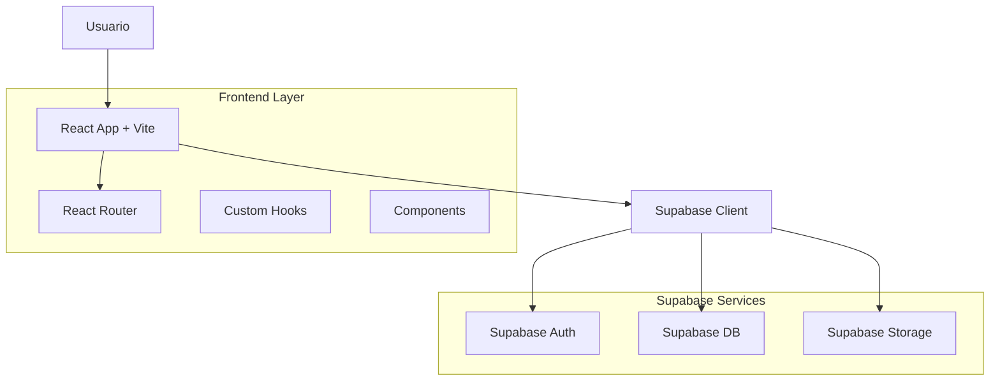

# Dots Memories: Arquitectura Técnica

## 1. Arquitectura General



## 2. Stack Tecnológico

- **Frontend**: React@18 + Vite@4 + TailwindCSS@3
- **Routing**: React Router@6
- **Estado**: React Context + Local Storage (favoritos)
- **Backend**: Supabase (Auth + PostgreSQL + Storage)
- **Validación**: Zod (opcional pero recomendado)
- **Fechas**: date-fns
- **Íconos**: Lucide React

## 3. Definición de Rutas

| Ruta | Propósito | Componente | Auth Required |
|------|-----------|------------|---------------|
| `/` | Feed personal con todos mis memories | `Feed.jsx` | ✅ |
| `/memory/create` | Formulario para crear nuevo memory | `CreateMemory.jsx` | ✅ |
| `/memory/:id` | Detalle completo de un memory | `MemoryDetail.jsx` | ✅ |
| `/memory/:id/edit` | Editar memory existente | `EditMemory.jsx` | ✅ |
| `/u/:username` | Perfil público de usuario | `UserProfile.jsx` | ❌ |
| `/s/:token` | Vista pública de memory compartido | `SharedMemory.jsx` | ❌ |
| `/timeline` | Vista timeline de memories | `TimelineView.jsx` | ✅ |
| `/map` | Memories geolocalizados en mapa | `MapView.jsx` | ✅ |
| `/circles` | Gestión de círculos de confianza | `Circles.jsx` | ✅ |
| `/discover` | Explorar memories públicos | `Discover.jsx` | ❌ |
| `/login` | Login de usuario | `Login.jsx` | ❌ |
| `/register` | Registro de nuevo usuario | `Register.jsx` | ❌ |

## 4. Modelos de Datos

### 4.1 Tabla Principal: memories
```sql
-- Tabla existente (ya creada)
CREATE TABLE memories (
    id UUID PRIMARY KEY DEFAULT gen_random_uuid(),
    user_id UUID REFERENCES auth.users(id) ON DELETE CASCADE,
    title VARCHAR(255) NOT NULL,
    content TEXT NOT NULL,
    date DATE NOT NULL,
    location VARCHAR(255),
    visibility VARCHAR(20) DEFAULT 'private' CHECK (visibility IN ('private', 'public', 'unlisted')),
    share_token VARCHAR(32) UNIQUE,
    created_at TIMESTAMP WITH TIME ZONE DEFAULT NOW(),
    updated_at TIMESTAMP WITH TIME ZONE DEFAULT NOW()
);

-- Índices para performance
CREATE INDEX idx_memories_user_id ON memories(user_id);
CREATE INDEX idx_memories_created_at ON memories(created_at DESC);
CREATE INDEX idx_memories_visibility ON memories(visibility);
CREATE INDEX idx_memories_share_token ON memories(share_token);
CREATE INDEX idx_memories_date ON memories(date DESC);

-- Políticas RLS (Row Level Security)
-- Usuarios autenticados pueden ver sus propios memories
CREATE POLICY "Users can view own memories" ON memories
    FOR SELECT USING (auth.uid() = user_id);

-- Usuarios autenticados pueden crear memories
CREATE POLICY "Users can create memories" ON memories
    FOR INSERT WITH CHECK (auth.uid() = user_id);

-- Usuarios autenticados pueden actualizar sus memories
CREATE POLICY "Users can update own memories" ON memories
    FOR UPDATE USING (auth.uid() = user_id);

-- Usuarios autenticados pueden eliminar sus memories
CREATE POLICY "Users can delete own memories" ON memories
    FOR DELETE USING (auth.uid() = user_id);

-- Memories públicas pueden ser vistas por todos (incluido anon)
CREATE POLICY "Public memories are viewable by everyone" ON memories
    FOR SELECT USING (visibility = 'public');

-- Memories con share_token pueden ser vistas con el token
CREATE POLICY "Shared memories are viewable with token" ON memories
    FOR SELECT USING (visibility = 'unlisted' AND share_token IS NOT NULL);
```

### 4.2 Tablas de Fase 3 (Futuro)
```sql
-- Reacciones (Fase 3)
CREATE TABLE reactions (
    id UUID PRIMARY KEY DEFAULT gen_random_uuid(),
    memory_id UUID REFERENCES memories(id) ON DELETE CASCADE,
    user_id UUID REFERENCES auth.users(id) ON DELETE CASCADE,
    type VARCHAR(20) CHECK (type IN ('love', 'reflect', 'connect', 'inspire')),
    created_at TIMESTAMP WITH TIME ZONE DEFAULT NOW(),
    UNIQUE(memory_id, user_id)
);

-- Comentarios (Fase 3)
CREATE TABLE comments (
    id UUID PRIMARY KEY DEFAULT gen_random_uuid(),
    memory_id UUID REFERENCES memories(id) ON DELETE CASCADE,
    user_id UUID REFERENCES auth.users(id) ON DELETE CASCADE,
    content TEXT NOT NULL,
    parent_id UUID REFERENCES comments(id) ON DELETE CASCADE,
    created_at TIMESTAMP WITH TIME ZONE DEFAULT NOW(),
    updated_at TIMESTAMP WITH TIME ZONE DEFAULT NOW()
);

-- Círculos (Fase 3)
CREATE TABLE circles (
    id UUID PRIMARY KEY DEFAULT gen_random_uuid(),
    name VARCHAR(100) NOT NULL,
    description TEXT,
    created_by UUID REFERENCES auth.users(id) ON DELETE CASCADE,
    created_at TIMESTAMP WITH TIME ZONE DEFAULT NOW()
);

-- Miembros de círculos (Fase 3)
CREATE TABLE circle_members (
    circle_id UUID REFERENCES circles(id) ON DELETE CASCADE,
    user_id UUID REFERENCES auth.users(id) ON DELETE CASCADE,
    role VARCHAR(20) DEFAULT 'member' CHECK (role IN ('admin', 'member')),
    joined_at TIMESTAMP WITH TIME ZONE DEFAULT NOW(),
    PRIMARY KEY (circle_id, user_id)
);

-- Media adjunto (Fase 3)
CREATE TABLE memory_media (
    id UUID PRIMARY KEY DEFAULT gen_random_uuid(),
    memory_id UUID REFERENCES memories(id) ON DELETE CASCADE,
    type VARCHAR(20) CHECK (type IN ('image', 'audio', 'location')),
    url TEXT NOT NULL,
    metadata JSONB,
    created_at TIMESTAMP WITH TIME ZONE DEFAULT NOW()
);
```

## 5. Supabase Client Configuration

### 5.1 Configuración Base (supabase.js)
```jsx
import { createClient } from '@supabase/supabase-js'

const supabaseUrl = import.meta.env.VITE_SUPABASE_URL
const supabaseAnonKey = import.meta.env.VITE_SUPABASE_ANON_KEY

export const supabase = createClient(supabaseUrl, supabaseAnonKey, {
  auth: {
    autoRefreshToken: true,
    persistSession: true,
    detectSessionInUrl: true
  },
  global: {
    headers: {
      'x-application-name': 'dots-memories',
    },
  },
})

// Helper para obtener usuario actual
export const getCurrentUser = async () => {
  const { data: { user } } = await supabase.auth.getUser()
  return user
}

// Helper para manejar errores
export const handleSupabaseError = (error) => {
  console.error('Supabase error:', error)
  
  if (error.code === 'PGRST116') {
    throw new Error('No tienes permisos para esta acción')
  }
  
  if (error.code === '23505') {
    throw new Error('Este elemento ya existe')
  }
  
  throw new Error(error.message || 'Error en la base de datos')
}
```

### 5.2 Hooks Personalizados

```jsx
// hooks/useMemories.js
import { useState, useEffect } from 'react'
import { supabase } from '../lib/supabase'

export const useMemories = (filters = {}) => {
  const [memories, setMemories] = useState([])
  const [loading, setLoading] = useState(true)
  const [error, setError] = useState(null)

  useEffect(() => {
    fetchMemories()
  }, [filters])

  const fetchMemories = async () => {
    try {
      setLoading(true)
      
      let query = supabase
        .from('memories')
        .select(`
          *,
          users:user_id (id, email, username, avatar_url)
        `)
        .order('created_at', { ascending: false })

      // Aplicar filtros
      if (filters.visibility) {
        query = query.eq('visibility', filters.visibility)
      }
      
      if (filters.userId) {
        query = query.eq('user_id', filters.userId)
      }
      
      if (filters.search) {
        query = query.or(`title.ilike.%${filters.search}%,content.ilike.%${filters.search}%`)
      }
      
      if (filters.dateFrom) {
        query = query.gte('date', filters.dateFrom)
      }
      
      if (filters.dateTo) {
        query = query.lte('date', filters.dateTo)
      }

      const { data, error } = await query

      if (error) throw error

      setMemories(data || [])
    } catch (error) {
      setError(error.message)
    } finally {
      setLoading(false)
    }
  }

  const createMemory = async (memoryData) => {
    try {
      const { data, error } = await supabase
        .from('memories')
        .insert([{
          ...memoryData,
          share_token: memoryData.visibility === 'unlisted' 
            ? generateShareToken() 
            : null
        }])
        .select()
        .single()

      if (error) throw error

      // Actualizar lista local
      setMemories(prev => [data, ...prev])
      return data
    } catch (error) {
      throw error
    }
  }

  const updateMemory = async (id, updates) => {
    try {
      const { data, error } = await supabase
        .from('memories')
        .update(updates)
        .eq('id', id)
        .select()
        .single()

      if (error) throw error

      // Actualizar lista local
      setMemories(prev => prev.map(m => m.id === id ? data : m))
      return data
    } catch (error) {
      throw error
    }
  }

  const deleteMemory = async (id) => {
    try {
      const { error } = await supabase
        .from('memories')
        .delete()
        .eq('id', id)

      if (error) throw error

      // Actualizar lista local
      setMemories(prev => prev.filter(m => m.id !== id))
    } catch (error) {
      throw error
    }
  }

  return {
    memories,
    loading,
    error,
    createMemory,
    updateMemory,
    deleteMemory,
    refetch: fetchMemories
  }
}

// hooks/useAuth.js
export const useAuth = () => {
  const [user, setUser] = useState(null)
  const [loading, setLoading] = useState(true)

  useEffect(() => {
    // Get initial session
    supabase.auth.getSession().then(({ data: { session } }) => {
      setUser(session?.user ?? null)
      setLoading(false)
    })

    // Listen for auth changes
    const { data: { subscription } } = supabase.auth.onAuthStateChange(
      (event, session) => {
        setUser(session?.user ?? null)
      }
    )

    return () => subscription.unsubscribe()
  }, [])

  const signIn = async (email, password) => {
    const { data, error } = await supabase.auth.signInWithPassword({
      email,
      password,
    })
    
    if (error) throw error
    return data
  }

  const signUp = async (email, password, username) => {
    const { data, error } = await supabase.auth.signUp({
      email,
      password,
      options: {
        data: { username }
      }
    })
    
    if (error) throw error
    return data
  }

  const signOut = async () => {
    const { error } = await supabase.auth.signOut()
    if (error) throw error
  }

  return {
    user,
    loading,
    signIn,
    signUp,
    signOut
  }
}
```

## 6. Componentes Core

### 6.1 MemoryGrid con Filtros
```jsx
// components/MemoryGrid.jsx
import { useState, useMemo } from 'react'
import { useMemories } from '../hooks/useMemories'
import MemoryCard from './MemoryCard'
import FilterBar from './FilterBar'
import EmptyState from './EmptyState'

const MemoryGrid = () => {
  const [filters, setFilters] = useState({
    visibility: 'all', // all, private, public
    search: '',
    dateFrom: null,
    dateTo: null
  })

  const { memories, loading, createMemory, deleteMemory } = useMemories(filters)

  const filteredMemories = useMemo(() => {
    let filtered = memories

    // Filtro de favoritos (local)
    if (filters.showFavorites) {
      const favorites = JSON.parse(localStorage.getItem('favorites') || '[]')
      filtered = filtered.filter(m => favorites.includes(m.id))
    }

    return filtered
  }, [memories, filters])

  if (loading) {
    return (
      <div className="grid grid-cols-1 md:grid-cols-2 lg:grid-cols-3 gap-6">
        {[...Array(6)].map((_, i) => (
          <div key={i} className="animate-pulse">
            <div className="bg-gray-200 h-64 rounded-2xl" />
          </div>
        ))}
      </div>
    )
  }

  if (filteredMemories.length === 0) {
    return <EmptyState onCreate={() => {}} />
  }

  return (
    <div className="space-y-6">
      <FilterBar 
        filters={filters} 
        onFiltersChange={setFilters}
        totalCount={memories.length}
        filteredCount={filteredMemories.length}
      />
      
      <div className="grid grid-cols-1 md:grid-cols-2 lg:grid-cols-3 gap-6">
        {filteredMemories.map(memory => (
          <MemoryCard
            key={memory.id}
            memory={memory}
            onDelete={deleteMemory}
            onFavorite={(id) => {
              const favorites = JSON.parse(localStorage.getItem('favorites') || '[]')
              const newFavorites = favorites.includes(id)
                ? favorites.filter(f => f !== id)
                : [...favorites, id]
              localStorage.setItem('favorites', JSON.stringify(newFavorites))
            }}
            isFavorite={JSON.parse(localStorage.getItem('favorites') || '[]').includes(memory.id)}
          />
        ))}
      </div>
    </div>
  )
}
```

### 6.2 FilterBar Component
```jsx
// components/FilterBar.jsx
import { useState } from 'react'
import { Search, Filter, Calendar, Heart, Globe, Lock } from 'lucide-react'

const FilterBar = ({ filters, onFiltersChange, totalCount, filteredCount }) => {
  const [showAdvanced, setShowAdvanced] = useState(false)

  const handleVisibilityChange = (visibility) => {
    onFiltersChange({ ...filters, visibility })
  }

  const handleSearchChange = (search) => {
    onFiltersChange({ ...filters, search })
  }

  const toggleFavorites = () => {
    onFiltersChange({ ...filters, showFavorites: !filters.showFavorites })
  }

  return (
    <div className="bg-white rounded-2xl p-6 shadow-sm border border-gray-100">
      <div className="flex flex-col sm:flex-row gap-4">
        {/* Search */}
        <div className="relative flex-1">
          <Search className="absolute left-3 top-1/2 transform -translate-y-1/2 
                           text-gray-400 w-4 h-4" />
          <input
            type="text"
            placeholder="Buscar en tus memories..."
            value={filters.search}
            onChange={(e) => handleSearchChange(e.target.value)}
            className="w-full pl-10 pr-4 py-2 border border-gray-200 rounded-xl 
                     focus:outline-none focus:ring-2 focus:ring-orange-500 
                     focus:border-transparent"
          />
        </div>

        {/* Visibility Filter */}
        <div className="flex gap-2">
          <button
            onClick={() => handleVisibilityChange('all')}
            className={`px-4 py-2 rounded-xl flex items-center gap-2 transition-colors ${
              filters.visibility === 'all'
                ? 'bg-orange-100 text-orange-700 border-2 border-orange-300'
                : 'bg-gray-50 text-gray-600 hover:bg-gray-100'
            }`}
          >
            <Globe className="w-4 h-4" />
            <span className="hidden sm:inline">Todos</span>
          </button>
          
          <button
            onClick={() => handleVisibilityChange('private')}
            className={`px-4 py-2 rounded-xl flex items-center gap-2 transition-colors ${
              filters.visibility === 'private'
                ? 'bg-orange-100 text-orange-700 border-2 border-orange-300'
                : 'bg-gray-50 text-gray-600 hover:bg-gray-100'
            }`}
          >
            <Lock className="w-4 h-4" />
            <span className="hidden sm:inline">Privados</span>
          </button>
          
          <button
            onClick={() => handleVisibilityChange('public')}
            className={`px-4 py-2 rounded-xl flex items-center gap-2 transition-colors ${
              filters.visibility === 'public'
                ? 'bg-orange-100 text-orange-700 border-2 border-orange-300'
                : 'bg-gray-50 text-gray-600 hover:bg-gray-100'
            }`}
          >
            <Globe className="w-4 h-4" />
            <span className="hidden sm:inline">Públicos</span>
          </button>
        </div>

        {/* Favorites */}
        <button
          onClick={toggleFavorites}
          className={`px-4 py-2 rounded-xl flex items-center gap-2 transition-colors ${
            filters.showFavorites
              ? 'bg-pink-100 text-pink-700 border-2 border-pink-300'
              : 'bg-gray-50 text-gray-600 hover:bg-gray-100'
          }`}
        >
          <Heart className="w-4 h-4" fill={filters.showFavorites ? 'currentColor' : 'none'} />
          <span className="hidden sm:inline">Favoritos</span>
        </button>

        {/* Advanced Filters Toggle */}
        <button
          onClick={() => setShowAdvanced(!showAdvanced)}
          className="px-4 py-2 rounded-xl bg-gray-50 text-gray-600 
                   hover:bg-gray-100 flex items-center gap-2"
        >
          <Filter className="w-4 h-4" />
          <span className="hidden sm:inline">Más</span>
        </button>
      </div>

      {/* Advanced Filters */}
      {showAdvanced && (
        <div className="mt-4 pt-4 border-t border-gray-200">
          <div className="grid grid-cols-1 sm:grid-cols-2 gap-4">
            {/* Date Range */}
            <div>
              <label className="block text-sm font-medium text-gray-700 mb-2">
                <Calendar className="w-4 h-4 inline mr-1" />
                Rango de fechas
              </label>
              <div className="flex gap-2">
                <input
                  type="date"
                  value={filters.dateFrom || ''}
                  onChange={(e) => onFiltersChange({ ...filters, dateFrom: e.target.value })}
                  className="flex-1 px-3 py-2 border border-gray-200 rounded-lg 
                           focus:outline-none focus:ring-2 focus:ring-orange-500"
                />
                <span className="self-center text-gray-500">a</span>
                <input
                  type="date"
                  value={filters.dateTo || ''}
                  onChange={(e) => onFiltersChange({ ...filters, dateTo: e.target.value })}
                  className="flex-1 px-3 py-2 border border-gray-200 rounded-lg 
                           focus:outline-none focus:ring-2 focus:ring-orange-500"
                />
              </div>
            </div>
          </div>
        </div>
      )}

      {/* Results Count */}
      <div className="mt-4 text-sm text-gray-600">
        Mostrando {filteredCount} de {totalCount} memories
      </div>
    </div>
  )
}
```

## 7. Migración de is_private a visibility

### 7.1 Script de Migración
```sql
-- Paso 1: Agregar nueva columna
ALTER TABLE memories 
ADD COLUMN visibility VARCHAR(20) DEFAULT 'private';

-- Paso 2: Migrar datos
UPDATE memories 
SET visibility = CASE 
  WHEN is_private = true THEN 'private'
  ELSE 'public'
END;

-- Paso 3: Agregar constraint
ALTER TABLE memories 
ADD CONSTRAINT check_visibility 
CHECK (visibility IN ('private', 'public', 'unlisted'));

-- Paso 4: Agregar share_token para unlisted
ALTER TABLE memories 
ADD COLUMN share_token VARCHAR(32) UNIQUE;

-- Paso 5: Generar tokens para memories públicas existentes
UPDATE memories 
SET share_token = md5(random()::text || clock_timestamp()::text)::varchar(32)
WHERE visibility = 'public';

-- Paso 6: Eliminar columna antigua (después de verificar migración)
-- ALTER TABLE memories DROP COLUMN is_private;
```

### 7.2 Actualización en Frontend
```jsx
// Actualizar formulario de creación/edición
const MemoryForm = ({ memory, onSubmit }) => {
  const [formData, setFormData] = useState({
    title: memory?.title || '',
    content: memory?.content || '',
    date: memory?.date || new Date().toISOString().split('T')[0],
    location: memory?.location || '',
    visibility: memory?.visibility || 'private' // Cambiado de is_private
  })

  const handleSubmit = async (e) => {
    e.preventDefault()
    
    // Generar share_token si es unlisted
    const data = {
      ...formData,
      share_token: formData.visibility === 'unlisted' 
        ? generateShareToken()
        : null
    }
    
    await onSubmit(data)
  }

  return (
    <form onSubmit={handleSubmit} className="space-y-6">
      {/* Campos existentes... */}
      
      {/* Visibility Selector */}
      <div>
        <label className="block text-sm font-medium text-gray-700 mb-2">
          Visibilidad
        </label>
        <div className="grid grid-cols-3 gap-3">
          <label className="cursor-pointer">
            <input
              type="radio"
              name="visibility"
              value="private"
              checked={formData.visibility === 'private'}
              onChange={(e) => setFormData({ ...formData, visibility: e.target.value })}
              className="sr-only"
            />
            <div className={`p-4 rounded-xl border-2 text-center transition-colors ${
              formData.visibility === 'private'
                ? 'border-orange-500 bg-orange-50 text-orange-700'
                : 'border-gray-200 hover:border-gray-300'
            }`}>
              <Lock className="w-6 h-6 mx-auto mb-2" />
              <div className="font-medium">Privado</div>
              <div className="text-sm text-gray-500">Solo tú</div>
            </div>
          </label>
          
          <label className="cursor-pointer">
            <input
              type="radio"
              name="visibility"
              value="unlisted"
              checked={formData.visibility === 'unlisted'}
              onChange={(e) => setFormData({ ...formData, visibility: e.target.value })}
              className="sr-only"
            />
            <div className={`p-4 rounded-xl border-2 text-center transition-colors ${
              formData.visibility === 'unlisted'
                ? 'border-orange-500 bg-orange-50 text-orange-700'
                : 'border-gray-200 hover:border-gray-300'
            }`}>
              <Link className="w-6 h-6 mx-auto mb-2" />
              <div className="font-medium">Compartir</div>
              <div className="text-sm text-gray-500">Con link</div>
            </div>
          </label>
          
          <label className="cursor-pointer">
            <input
              type="radio"
              name="visibility"
              value="public"
              checked={formData.visibility === 'public'}
              onChange={(e) => setFormData({ ...formData, visibility: e.target.value })}
              className="sr-only"
            />
            <div className={`p-4 rounded-xl border-2 text-center transition-colors ${
              formData.visibility === 'public'
                ? 'border-orange-500 bg-orange-50 text-orange-700'
                : 'border-gray-200 hover:border-gray-300'
            }`}>
              <Globe className="w-6 h-6 mx-auto mb-2" />
              <div className="font-medium">Público</div>
              <div className="text-sm text-gray-500">Para todos</div>
            </div>
          </label>
        </div>
      </div>
      
      <button
        type="submit"
        className="w-full bg-gradient-to-r from-orange-400 to-pink-400 
                 text-white py-3 px-6 rounded-xl font-medium 
                 hover:shadow-lg transition-all duration-300"
      >
        {memory ? 'Actualizar Memory' : 'Crear Memory'}
      </button>
    </form>
  )
}

// Helper para generar share token
const generateShareToken = () => {
  return Math.random().toString(36).substring(2, 15) + 
         Math.random().toString(36).substring(2, 15)
}
```

## 8. Página Pública de Memory

```jsx
// pages/SharedMemory.jsx
import { useState, useEffect } from 'react'
import { useParams, Link } from 'react-router-dom'
import { supabase } from '../lib/supabase'
import MemoryDetail from '../components/MemoryDetail'

const SharedMemory = () => {
  const { token } = useParams()
  const [memory, setMemory] = useState(null)
  const [loading, setLoading] = useState(true)
  const [error, setError] = useState(null)

  useEffect(() => {
    fetchSharedMemory()
  }, [token])

  const fetchSharedMemory = async () => {
    try {
      setLoading(true)
      
      // No necesita auth - acceso público
      const { data, error } = await supabase
        .from('memories')
        .select(`
          *,
          users:user_id (id, username, avatar_url)
        `)
        .eq('share_token', token)
        .eq('visibility', 'unlisted')
        .single()

      if (error) throw error
      if (!data) throw new Error('Memory no encontrado')

      setMemory(data)
    } catch (error) {
      setError(error.message)
    } finally {
      setLoading(false)
    }
  }

  if (loading) {
    return (
      <div className="min-h-screen bg-gradient-to-br from-amber-50 to-orange-100 
                    flex items-center justify-center">
        <div className="text-center">
          <div className="w-16 h-16 bg-orange-200 rounded-full animate-pulse mx-auto mb-4" />
          <p className="text-gray-600">Cargando memory...</p>
        </div>
      </div>
    )
  }

  if (error) {
    return (
      <div className="min-h-screen bg-gradient-to-br from-amber-50 to-orange-100 
                    flex items-center justify-center">
        <div className="text-center max-w-md">
          <div className="w-16 h-16 bg-red-100 rounded-full flex items-center 
                         justify-center mx-auto mb-4">
            <span className="text-2xl">😔</span>
          </div>
          <h2 className="text-xl font-semibold text-gray-800 mb-2">
            Memory no encontrado
          </h2>
          <p className="text-gray-600 mb-6">
            {error || 'Este link puede haber expirado o el memory fue eliminado.'}
          </p>
          <Link
            to="/"
            className="inline-block bg-gradient-to-r from-orange-400 to-pink-400 
                     text-white px-6 py-3 rounded-xl font-medium 
                     hover:shadow-lg transition-all duration-300"
          >
            Crear mi primer memory
          </Link>
        </div>
      </div>
    )
  }

  return (
    <div className="min-h-screen bg-gradient-to-br from-amber-50 to-orange-100">
      <div className="max-w-4xl mx-auto px-4 py-8">
        {/* Header */}
        <div className="text-center mb-8">
          <h1 className="text-3xl font-serif text-gray-800 mb-2">
            Un memory compartido
          </h1>
          <p className="text-gray-600">
            Por @{memory.users?.username || 'usuario'}
          </p>
        </div>

        {/* Memory Detail */}
        <div className="bg-white rounded-3xl shadow-xl overflow-hidden">
          <MemoryDetail memory={memory} isPublic />
        </div>

        {/* CTA */}
        <div className="text-center mt-8">
          <p className="text-gray-600 mb-4">
            ¿Quieres crear tus propios memories?
          </p>
          <Link
            to="/register"
            className="inline-block bg-gradient-to-r from-orange-400 to-pink-400 
                     text-white px-8 py-3 rounded-xl font-medium 
                     hover:shadow-lg transition-all duration-300 mr-4"
          >
            Regístrate gratis
          </Link>
          <Link
            to="/login"
            className="inline-block text-orange-600 hover:text-orange-700 
                     font-medium"
          >
            O inicia sesión
          </Link>
        </div>
      </div>
    </div>
  )
}

export default SharedMemory
```

## 9. Optimización de Performance

### 9.1 Lazy Loading de Componentes
```jsx
// App.jsx con lazy loading
import { lazy, Suspense } from 'react'
import { Routes, Route } from 'react-router-dom'

// Lazy load de páginas menos críticas
const MapView = lazy(() => import('./pages/MapView'))
const TimelineView = lazy(() => import('./pages/TimelineView'))
const Circles = lazy(() => import('./pages/Circles'))
const Discover = lazy(() => import('./pages/Discover'))

function App() {
  return (
    <Suspense fallback={
      <div className="flex items-center justify-center min-h-screen">
        <div className="animate-spin rounded-full h-12 w-12 border-b-2 border-orange-500" />
      </div>
    }>
      <Routes>
        <Route path="/" element={<Layout />}>
          <Route index element={<Feed />} />
          <Route path="memory/create" element={<CreateMemory />} />
          <Route path="memory/:id" element={<MemoryDetail />} />
          <Route path="memory/:id/edit" element={<EditMemory />} />
          
          {/* Rutas lazy loaded */}
          <Route path="timeline" element={<TimelineView />} />
          <Route path="map" element={<MapView />} />
          <Route path="circles" element={<Circles />} />
          <Route path="discover" element={<Discover />} />
          
          <Route path="u/:username" element={<UserProfile />} />
          <Route path="s/:token" element={<SharedMemory />} />
        </Route>
        
        <Route path="/login" element={<Login />} />
        <Route path="/register" element={<Register />} />
      </Routes>
    </Suspense>
  )
}
```

### 9.2 Caché de Imágenes
```jsx
// hooks/useImageCache.js
import { useState, useEffect } from 'react'

export const useImageCache = (imageUrls) => {
  const [cachedImages, setCachedImages] = useState({})
  const [loading, setLoading] = useState(true)

  useEffect(() => {
    const cacheImages = async () => {
      const promises = imageUrls.map(url => {
        return new Promise((resolve, reject) => {
          const img = new Image()
          img.src = url
          img.onload = () => resolve({ url, status: 'loaded' })
          img.onerror = () => resolve({ url, status: 'error' })
        })
      })

      const results = await Promise.all(promises)
      const cache = results.reduce((acc, { url, status }) => {
        acc[url] = status
        return acc
      }, {})

      setCachedImages(cache)
      setLoading(false)
    }

    if (imageUrls?.length > 0) {
      cacheImages()
    }
  }, [imageUrls])

  return { cachedImages, loading }
}
```

## 10. Deployment

### 10.1 Variables de Entorno
```bash
# .env
VITE_SUPABASE_URL=https://tusupabase.supabase.co
VITE_SUPABASE_ANON_KEY=tu-anon-key-aqui
```

### 10.2 Build Optimization
```js
// vite.config.js
import { defineConfig } from 'vite'
import react from '@vitejs/plugin-react'
import { visualizer } from 'rollup-plugin-visualizer'

export default defineConfig({
  plugins: [
    react(),
    visualizer({
      filename: './dist/stats.html',
      open: true,
      gzipSize: true,
      brotliSize: true,
    })
  ],
  build: {
    rollupOptions: {
      output: {
        manualChunks: {
          'react-vendor': ['react', 'react-dom', 'react-router-dom'],
          'supabase': ['@supabase/supabase-js'],
          'icons': ['lucide-react'],
          'date-utils': ['date-fns']
        }
      }
    },
    target: 'es2015',
    minify: 'terser',
    terserOptions: {
      compress: {
        drop_console: true,
        drop_debugger: true
      }
    }
  }
})
```

Esta arquitectura te permite escalar Dots Memories de forma incremental, manteniendo siempre la compatibilidad con lo que ya tienes construido.