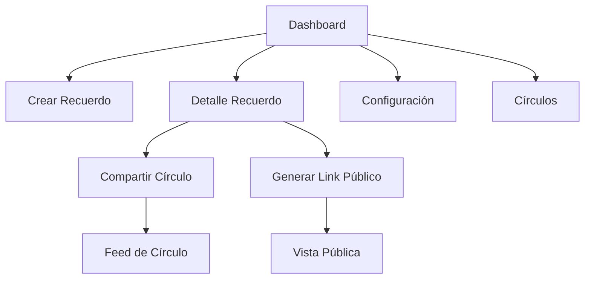

# Dots Memories - Requisitos del Producto

## 1. Product Overview

Dots Memories es una plataforma digital para guardar y compartir recuerdos personales de forma privada o colaborativa. Los usuarios pueden crear entradas de diario con texto, fotos y videos, organizarlas con etiquetas, y compartirlas selectivamente con círculos de confianza.

**Problema que resuelve**: Centralizar y preservar momentos importantes con control total sobre la privacidad y compartición.

**Mercado objetivo**: Usuarios que valoran la privacidad y quieren mantener sus memorias organizadas y seguras, con la opción de compartir con grupos específicos.

## 2. Core Features

### 2.1 User Roles

| Role | Registration Method | Core Permissions |
|------|---------------------|------------------|
| Usuario Regular | Email/password + OAuth | Crear recuerdos, unirse a círculos, comentar |
| Owner de Círculo | Se convierte al crear círculo | Gestionar círculo, invitar miembros, moderar contenido |
| Admin de Círculo | Promovido por owner | Mismos permisos que owner excepto eliminar círculo |
| Miembro de Círculo | Invitación aceptada | Ver y comentar recuerdos compartidos |

### 2.2 Feature Module

Nuestra plataforma de recuerdos consta de las siguientes páginas principales:

1. **Dashboard**: Feed personal de recuerdos, búsqueda y filtros
2. **Crear Recuerdo**: Formulario con editor de texto, subida de media y etiquetas
3. **Detalle Recuerdo**: Vista completa del recuerdo con comentarios y reacciones
4. **Círculos**: Gestión de grupos y membresía
5. **Compartido Público**: Vista de solo lectura para links compartidos

### 2.3 Page Details

| Page Name | Module Name | Feature description |
|-----------|-------------|---------------------|
| Dashboard | Feed de recuerdos | Lista cronológica de recuerdos propios y de círculos, con preview de contenido y miniaturas de media |
| Dashboard | Búsqueda y filtros | Barra de búsqueda por texto, filtro por etiquetas, rango de fechas y favoritos |
| Crear Recuerdo | Editor de texto | Campo título, editor de contenido enriquecido, guardado automático en borrador |
| Crear Recuerdo | Subida de media | Drag & drop de imágenes/videos, preview antes de subir, progreso de carga |
| Crear Recuerdo | Configuración de privacidad | Selector de privacidad (privado, link público, círculo), selector de círculos disponibles |
| Detalle Recuerdo | Vista de contenido | Mostrar título, contenido, media en galería, etiquetas, ubicación y fecha |
| Detalle Recuerdo | Interacciones sociales | Ver comentarios de miembros del círculo, agregar reacciones con emojis, marcar como favorito |
| Círculos | Lista de círculos | Tarjetas con nombre, cantidad de miembros y recuerdos compartidos |
| Círculos | Gestión de miembros | Ver lista de miembros con roles, invitar por email, gestionar permisos |
| Compartido Público | Vista pública | Mostrar recuerdo sin login requerido, solo lectura, sin acceso a comentarios |

## 3. Core Process

### Flujo de creación de recuerdo:
1. Usuario accede a "Nuevo Recuerdo" desde el dashboard
2. Completa título y contenido del recuerdo
3. Opcionalmente sube fotos/videos que se almacenan en Supabase Storage
4. Agrega etiquetas para organización
5. Selecciona nivel de privacidad (privado por defecto)
6. Guarda el recuerdo que aparece inmediatamente en su feed

### Flujo de compartición con círculo:
1. En detalle de recuerdo, usuario selecciona "Compartir con círculo"
2. Elige círculo destino de los disponibles
3. Miembros del círculo ven el recuerdo en su feed
4. Pueden comentar y reaccionar en tiempo real

### Flujo de compartición pública:
1. Usuario genera link público desde detalle de recuerdo
2. Sistema crea token único con expiración
3. Usuario comparte link externamente
4. Visitantes acceden sin login a vista de solo lectura

## 4. User Interface Design

### 4.1 Design Style

- **Colores primarios**: Azul profundo (#1e3a8a) y blanco
- **Colores secundarios**: Gris claro (#f3f4f6) y azul cielo (#3b82f6)
- **Botones**: Estilo redondeado con sombra sutil, hover con transición suave
- **Tipografía**: Inter para títulos, system-ui para contenido
- **Tamaños**: Títulos 24-32px, contenido 16px, texto pequeño 14px
- **Layout**: Card-based con grid responsivo, navegación lateral en desktop
- **Iconos**: Emoji nativos y lucide-react para consistencia

### 4.2 Page Design Overview

| Page Name | Module Name | UI Elements |
|-----------|-------------|-------------|
| Dashboard | Header | Logo centrado, avatar de usuario menú desplegable, botón nuevo recuerdo destacado |
| Dashboard | Feed cards | Grid de cards con imagen destacada, título, preview texto, fecha, etiquetas como pills, indicador de privacidad con icono |
| Crear Recuerdo | Formulario | Inputs con bordes redondeados, editor de texto minimalista, área de drag & drop con borde punteado al hover |
| Detalle Recuerdo | Contenido | Imagen hero ancho completo, contenido con buen espaciado, media en grid responsivo, comentarios con indentación y avatares |
| Círculos | Grid de círculos | Cards con gradient sutil, contadores en badges, acciones en dropdown, color según rol del usuario |

### 4.3 Responsiveness

**Desktop-first** con breakpoints:
- Desktop: 1280px+ con sidebar fijo y grid de 3 columnas
- Tablet: 768-1279px con navegación superior y grid de 2 columnas  
- Mobile: <768px con navegación inferior tipo app, cards apiladas verticalmente

Touch optimizado con áreas táctiles mínimas de 44px, gestos de swipe para navegación entre recuerdos, y botones flotantes para acciones principales en móvil.