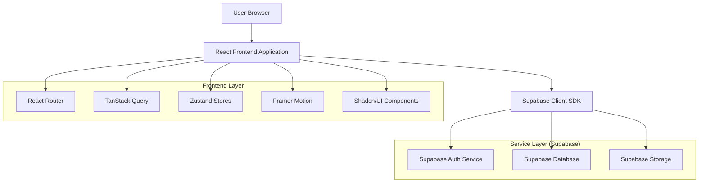
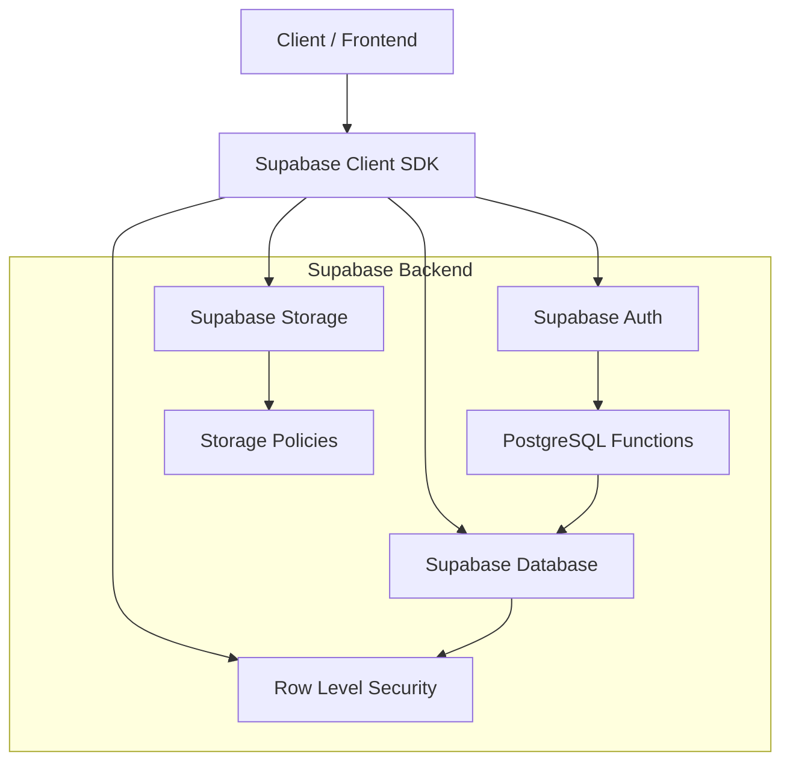
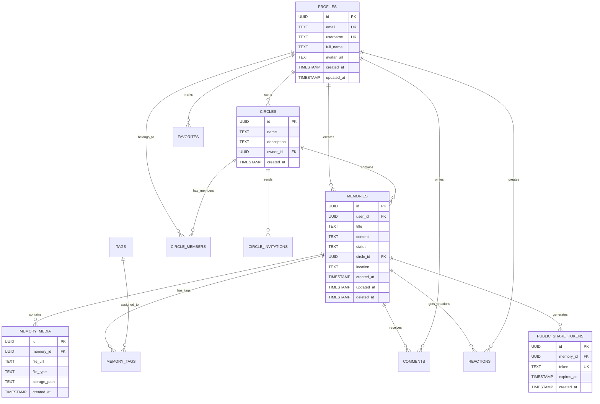

## 1. Architecture design



## 2. Technology Description

- **Frontend**: React@18 + TypeScript + Vite
- **Estilos**: TailwindCSS@4 + shadcn/ui components
- **Gestión de estado**: Zustand@5 para auth y language store
- **Query Client**: TanStack Query@5 para gestión de datos asíncronos
- **Routing**: React Router DOM@7
- **Animaciones**: Framer Motion@12
- **Backend**: Supabase (Auth + PostgreSQL + Storage)
- **Inicialización**: vite-init

### Dependencias principales:
```json
{
  "@supabase/supabase-js": "^2.97.0",
  "@tanstack/react-query": "^5.90.21",
  "@tanstack/react-query-devtools": "^5.91.3",
  "framer-motion": "^12.23.26",
  "lucide-react": "^0.511.0",
  "react-router-dom": "^7.3.0",
  "shadcn-ui": "^1.4.3",
  "tailwindcss": "^4.2.1",
  "zustand": "^5.0.3"
}
```

## 3. Route definitions

| Route | Purpose |
|-------|---------|
| `/` | Home page principal con hero y características |
| `/weddings` | Landing específica para bodas |
| `/demo` | Demo interactiva de la plataforma |
| `/login` | Página de autenticación de usuarios |
| `/signup` | Registro de nuevos usuarios |
| `/dashboard` | Panel principal del usuario autenticado |
| `/app/memories/new` | Formulario de creación de nuevo recuerdo |
| `/app/memories/:id` | Detalle completo de un recuerdo específico |
| `/share/:token` | Vista pública para acceso con token compartido |
| `/about` | Página de información sobre Lumina |
| `/contact` | Formulario de contacto |

## 4. API definitions

### 4.1 Core API Endpoints (Supabase)

#### Autenticación
```
POST /auth/v1/token
```
Request:
```json
{
  "email": "user@example.com",
  "password": "password123"
}
```

#### Gestión de Recuerdos
```
GET /rest/v1/memories?select=*&user_id=eq.{userId}
POST /rest/v1/memories
PUT /rest/v1/memories?id=eq.{memoryId}
DELETE /rest/v1/memories?id=eq.{memoryId}
```

#### Gestión de Medios
```
POST /storage/v1/object/memories/{userId}/{filename}
GET /storage/v1/object/public/memories/{userId}/{filename}
```

#### Compartir Público
```
POST /rest/v1/public_share_tokens
GET /rest/v1/public_share_tokens?token=eq.{token}
```

### 4.2 TypeScript Interfaces

```typescript
interface Memory {
  id: string;
  user_id: string;
  title: string;
  content: string;
  status: 'private' | 'public_link' | 'circle';
  circle_id?: string;
  location?: string;
  created_at: string;
  updated_at: string;
  memory_media?: MemoryMedia[];
  memory_tags?: MemoryTag[];
}

interface MemoryMedia {
  id: string;
  memory_id: string;
  file_url: string;
  file_type: 'image' | 'video';
  storage_path: string;
  created_at: string;
}

interface Profile {
  id: string;
  email: string;
  username: string;
  full_name?: string;
  avatar_url?: string;
  created_at: string;
  updated_at: string;
}

interface Circle {
  id: string;
  name: string;
  description?: string;
  owner_id: string;
  created_at: string;
}

interface PublicShareToken {
  id: string;
  memory_id: string;
  token: string;
  expires_at: string;
  created_at: string;
}
```

## 5. Server architecture diagram



## 6. Data model

### 6.1 Data model definition



### 6.2 Data Definition Language

#### Tabla principal de recuerdos (memories)
```sql
-- Crear tabla de recuerdos
CREATE TABLE memories (
    id UUID PRIMARY KEY DEFAULT gen_random_uuid(),
    user_id UUID NOT NULL REFERENCES profiles(id) ON DELETE CASCADE,
    title TEXT NOT NULL,
    content TEXT NOT NULL,
    status TEXT NOT NULL CHECK (status IN ('private', 'public_link', 'circle')),
    circle_id UUID REFERENCES circles(id) ON DELETE CASCADE,
    location TEXT,
    created_at TIMESTAMP WITH TIME ZONE DEFAULT NOW(),
    updated_at TIMESTAMP WITH TIME ZONE DEFAULT NOW(),
    deleted_at TIMESTAMP WITH TIME ZONE
);

-- Índices para performance
CREATE INDEX idx_memories_user_id ON memories(user_id);
CREATE INDEX idx_memories_created_at ON memories(created_at DESC);
CREATE INDEX idx_memories_status ON memories(status);
CREATE INDEX idx_memories_circle_id ON memories(circle_id);

-- Políticas RLS
ALTER TABLE memories ENABLE ROW LEVEL SECURITY;

CREATE POLICY "Usuarios pueden ver sus propios recuerdos" ON memories
    FOR SELECT USING (auth.uid() = user_id);

CREATE POLICY "Usuarios pueden crear recuerdos" ON memories
    FOR INSERT WITH CHECK (auth.uid() = user_id);

CREATE POLICY "Usuarios pueden actualizar sus propios recuerdos" ON memories
    FOR UPDATE USING (auth.uid() = user_id);

CREATE POLICY "Usuarios pueden eliminar sus propios recuerdos" ON memories
    FOR DELETE USING (auth.uid() = user_id);

-- Ver recuerdos compartidos con círculo
CREATE POLICY "Miembros pueden ver recuerdos del círculo" ON memories
    FOR SELECT USING (
        status = 'circle' AND is_circle_member(circle_id)
    );

-- Otorgar permisos
GRANT SELECT ON memories TO anon;
GRANT ALL ON memories TO authenticated;
```

#### Tabla de medios adjuntos (memory_media)
```sql
-- Crear tabla de medios
CREATE TABLE memory_media (
    id UUID PRIMARY KEY DEFAULT gen_random_uuid(),
    memory_id UUID NOT NULL REFERENCES memories(id) ON DELETE CASCADE,
    file_url TEXT NOT NULL,
    file_type TEXT NOT NULL CHECK (file_type IN ('image', 'video')),
    storage_path TEXT NOT NULL,
    created_at TIMESTAMP WITH TIME ZONE DEFAULT NOW()
);

-- Índice para búsquedas rápidas
CREATE INDEX idx_memory_media_memory_id ON memory_media(memory_id);

-- Políticas RLS
ALTER TABLE memory_media ENABLE ROW LEVEL SECURITY;

CREATE POLICY "Usuarios pueden ver medios de sus recuerdos" ON memory_media
    FOR SELECT USING (
        EXISTS (
            SELECT 1 FROM memories 
            WHERE memories.id = memory_media.memory_id 
            AND memories.user_id = auth.uid()
        )
    );

CREATE POLICY "Miembros pueden ver medios de círculo" ON memory_media
    FOR SELECT USING (
        EXISTS (
            SELECT 1 FROM memories 
            WHERE memories.id = memory_media.memory_id 
            AND memories.status = 'circle' 
            AND is_circle_member(memories.circle_id)
        )
    );

GRANT SELECT ON memory_media TO authenticated;
```

#### Configuración de almacenamiento (Storage)
```sql
-- Crear bucket para almacenamiento de recuerdos
INSERT INTO storage.buckets (id, name, public, file_size_limit, allowed_mime_types)
VALUES ('memories', 'memories', false, 52428800, ARRAY['image/jpeg', 'image/png', 'image/gif', 'video/mp4', 'video/quicktime']);

-- Políticas de almacenamiento
CREATE POLICY "Usuarios pueden subir archivos a sus carpetas" ON storage.objects
    FOR INSERT WITH CHECK (
        auth.uid()::text = (storage.foldername(name))[1]
    );

CREATE POLICY "Usuarios pueden ver archivos de sus recuerdos" ON storage.objects
    FOR SELECT USING (
        auth.uid()::text = (storage.foldername(name))[1] OR
        EXISTS (
            SELECT 1 FROM memories 
            JOIN memory_media ON memories.id = memory_media.memory_id
            WHERE memory_media.storage_path = name
            AND memories.status = 'circle'
            AND is_circle_member(memories.circle_id)
        )
    );

GRANT ALL ON storage.objects TO authenticated;
```