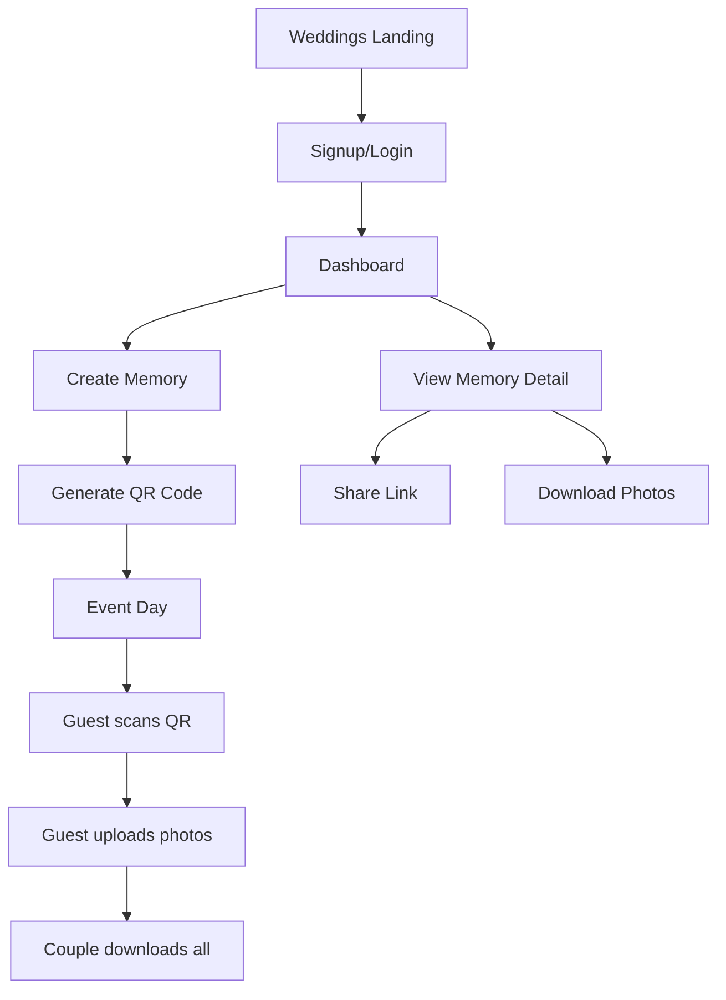

## 1. Product Overview

Lumina es una plataforma de gestión de recuerdos fotográficos diseñada especialmente para bodas y eventos especiales. Permite a las parejas crear álbumes privados, compartirlos fácilmente con invitados mediante códigos QR, y recopilar todas las fotos del evento en un solo lugar seguro y organizado.

El producto resuelve el problema común de las fotos perdidas en chats de WhatsApp o comprimidas en redes sociales, proporcionando una experiencia de galería privada y de alta calidad para momentos inolvidables.

## 2. Core Features

### 2.1 User Roles
| Role | Registration Method | Core Permissions |
|------|---------------------|------------------|
| Couple/Host | Email registration | Create albums, manage QR codes, download all photos, manage guest access |
| Guest | No registration required | Upload photos, view shared album, add comments |
| General User | Email registration | Create personal memories, organize in albums, share privately |

### 2.2 Feature Module

Nuestra plataforma de recuerdos consiste en las siguientes páginas principales:

1. **Página de Inicio**: Presentación del servicio, características principales, llamadas a la acción.
2. **Página de Bodas**: Landing específica para bodas con proceso de 3 pasos y destacados.
3. **Dashboard**: Gestión de álbumes y recuerdos personales del usuario.
4. **Crear Recuerdo**: Formulario para crear nuevos álbumes con fotos y descripciones.
5. **Detalle de Recuerdo**: Visualización del álbum con fotos organizadas, comentarios y opciones de compartir.
6. **Vista Pública**: Acceso sin registro para invitados con códigos QR o enlaces compartidos.
7. **Autenticación**: Login y registro de usuarios.

### 2.3 Page Details
| Page Name | Module Name | Feature description |
|-----------|-------------|---------------------|
| Home page | Hero section | Presenta el valor principal con título impactante y descripción clara. Incluye botones de CTA principales y secundarios. |
| Home page | Features section | Muestra 3 características principales: Álbumes anidados, Compartir fácil, Privacidad y seguridad. |
| Home page | Showcase gallery | Galería de imágenes de ejemplo mostrando la experiencia visual de la plataforma. |
| Weddings page | Hero section | Landing específica para bodas con mensaje romántico y destacado visual de parejas. |
| Weddings page | How it works | Proceso de 3 pasos: Crear álbum, Imprimir QR, Guardar para siempre. |
| Weddings page | Feature highlight | Sección de llamada a la acción final con diseño destacado. |
| Dashboard | Header stats | Muestra estadísticas de recuerdos totales, fotos compartidas y fotos totales. |
| Dashboard | Memory grid | Grid visual de todos los recuerdos del usuario con miniaturas y estados. |
| Dashboard | Actions | Botón para crear nuevo recuerdo y opciones de filtrado. |
| Create Memory | Form | Formulario para título, descripción, ubicación y portada del álbum. |
| Create Memory | Media upload | Upload de múltiples fotos y videos con compresión automática. |
| Create Memory | Album organization | Creación de sub-álbumes dentro del recuerdo principal. |
| Memory Detail | Gallery viewer | Visualización de fotos en grid y vista ampliada individual. |
| Memory Detail | Comments system | Sistema de comentarios para miembros del círculo. |
| Memory Detail | Sharing options | Generación de enlaces compartidos y códigos QR. |
| Memory Detail | Download feature | Descarga de fotos individuales o álbumes completos. |
| Public View | Guest upload | Permite a invitados subir fotos sin registro. |
| Public View | Responsive gallery | Galería optimizada para móviles y desktop. |
| Auth | Login/Signup | Formularios de autenticación con email y contraseña. |

## 3. Core Process

### Flujo Principal de Usuario (Parejas/Anfitriones):
1. Usuario llega a la página de bodas → Se inspira con el diseño y proceso
2. Crea cuenta gratuita → Accede al dashboard
3. Crea nuevo álbum de boda → Añade detalles y portada
4. Genera código QR único → Lo imprime o descarga
5. Coloca QR en mesas del evento → Invitados escanean y suben fotos
6. Recopila todas las fotos → Descarga en alta calidad

### Flujo de Invitado:
1. Invitado escanea código QR → Accede a vista pública del álbum
2. Puede ver fotos existentes → Subir sus propias fotos
3. Añadir comentarios → Interactuar sin necesidad de cuenta

## 4. User Interface Design

### 4.1 Design Style
- **Colores primarios**: Rosa #f43f5e (rose-500) para elementos destacados
- **Colores secundarios**: Gris oscuro #111827 para texto principal
- **Colores de fondo**: Blanco puro y gris muy claro #f9fafb
- **Botones**: Estilo redondeado (rounded-full) con sombras suaves
- **Tipografía**: Font-serif para títulos principales, sans-serif para contenido
- **Iconos**: Lucide React icons con estilo outline
- **Layout**: Card-based con espaciado generoso y bordes suaves

### 4.2 Page Design Overview
| Page Name | Module Name | UI Elements |
|-----------|-------------|-------------|
| Weddings page | Hero section | Título serif de 8xl, texto destacado en cursiva rosa, imágenes flotantes rotadas, botones con hover scale effect |
| Weddings page | How it works | Cards blancas con bordes redondeados de 3xl, iconos en círculos rosa-50, tipografía bold para títulos |
| Dashboard | Header | Título ultra-bold de 8xl, stats pills minimalistas con tracking-widest, botón con transform hover |
| Memory Detail | Gallery | Grid responsive de imágenes, modal de vista ampliada con navegación, botones de acción flotantes |
| Public View | Upload area | Drag & drop zone con bordes punteados, preview de imágenes, botón de subida prominente |

### 4.3 Responsiveness
- Diseño desktop-first con adaptación mobile
- Breakpoints: sm (640px), md (768px), lg (1024px), xl (1280px)
- Optimización táctil para botones y áreas de interacción
- Grid layouts que se adaptan de 4 columnas (desktop) a 1 columna (móvil)
- Menús de navegación que colapsan en móvil con menú hamburger

### 4.4 3D Scene Guidance
No aplica para este proyecto - la experiencia es principalmente 2D con interacciones estándar web.