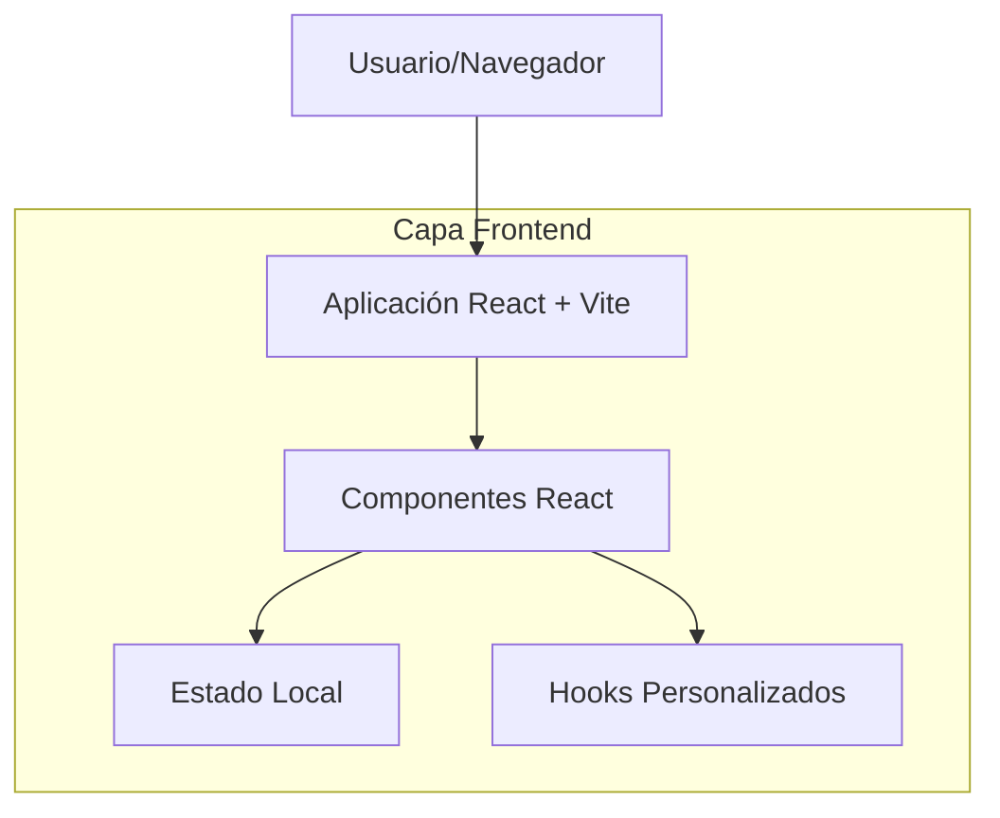

## 1. Arquitectura del proyecto



## 2. Descripción de Tecnologías

* Frontend: React\@18 + Vite\@5

* Herramienta de Inicialización: vite-init

* Estilos: CSS Modules / Tailwind CSS (opcional)

* Backend: Ninguno (proyecto frontend puro)

* Dependencias esenciales:

  * react\@18.2.0

  * react-dom\@18.2.0

  * vite\@5.0.0

  * @vitejs/plugin-react\@4.0.0

## 3. Definición de Rutas

| Ruta     | Propósito                             |
| -------- | ------------------------------------- |
| /        | Página principal, componente App raíz |
| /about   | Página de información del proyecto    |
| /contact | Página de contacto                    |

## 4. Estructura del Proyecto

```
src/
├── components/          # Componentes React reutilizables
├── pages/              # Páginas principales de la aplicación
├── hooks/              # Hooks personalizados
├── utils/              # Funciones de utilidad
├── assets/             # Recursos estáticos (imágenes, estilos)
├── App.jsx             # Componente principal
├── main.jsx            # Punto de entrada de la aplicación
└── index.css           # Estilos globales
```

## 5. Configuración de Vite

El proyecto utilizará la configuración estándar de Vite con las siguientes características:

* Hot Module Replacement (HMR) para desarrollo rápido

* Build optimizado para producción

* Soporte para JSX sin configuración adicional

* Resolución de módulos optimizada

